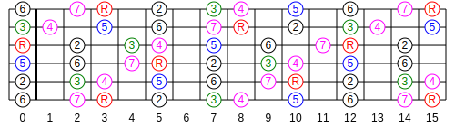
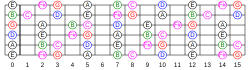
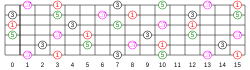
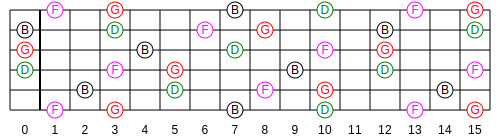

pyfrets
=======

What is ``pyfrets``?
--------------------

``pyfrets`` is a set of Python tools for guitar players.

``pyfrets`` makes it possible to build scales and chords and to display them
on a guitar fretboard. The fretboard can be rendered as:

- Text with ANSI colours
- SVG
- PDF

G major scale
.............

G7 chord
........

Implementation status
---------------------

``pyfrets`` is currently a work in progress. While the command line tools are
functional, the internal APIs are subject to change.

License
-------

``pyfrets`` is released under the BSD license.
